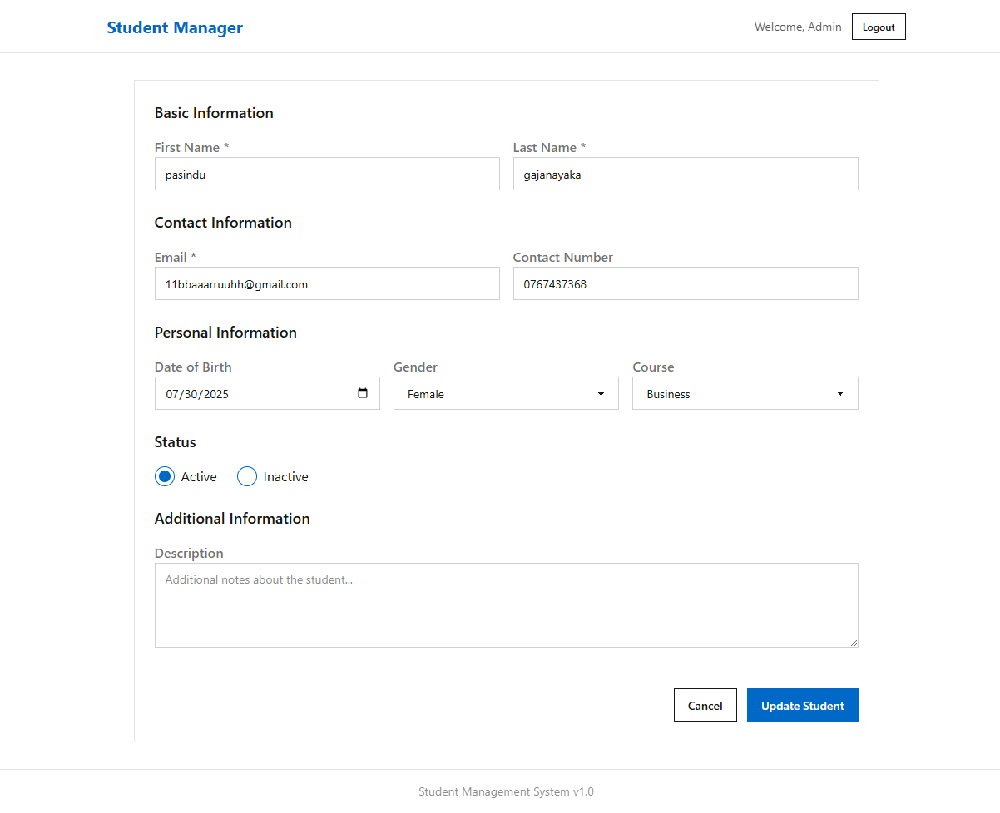

# Laravel CRUD Application

This is a basic CRUD (Create, Read, Update, Delete) application built with the Laravel framework for managing student records.

## Features

### Core Features
- **Student Management**: Complete CRUD operations for student records
- **User Authentication**: Secure login system for admin users
- **Search Functionality**: Search students by name or email
- **Status Toggle**: Activate/deactivate student records with AJAX
- **Data Export**: Export student data to Excel/XLSX and PDF formats
- **Pagination**: Efficient data browsing with paginated results

### Student Information Fields
- First Name and Last Name
- Email Address (unique)
- Contact Number
- Date of Birth
- Gender (Male/Female)
- Course Type (IT, Business, Arts)
- Status (Active/Inactive)
- Description

### Technical Features
- **AJAX Operations**: Seamless form submissions and status updates without page refresh
- **Responsive Design**: Built with Tailwind CSS and DaisyUI for modern UI
- **Data Validation**: Server-side validation for all input fields
- **Database Migrations**: Structured database schema management
- **SQLite Database**: Lightweight database for easy setup

## Prerequisites

Before you begin, ensure you have the following installed on your system:

*   PHP (version 8.2 or higher)
*   Composer
*   Node.js and npm

## Getting Started

Follow these instructions to get the project up and running on your local machine.

### 1. Clone the Repository

Clone this repository to your local machine:

```bash
git clone https://github.com/malithonline/crud-laravel-student-managment.git
cd crud-laravel-student-managment
```

### 2. Install Dependencies

Install the required PHP and JavaScript dependencies:

```bash
composer install
npm install
```

### 3. Environment Configuration

Create a copy of the `.env.example` file and name it `.env`. This file will hold your application's environment-specific settings.

```bash
copy .env.example .env
```

Generate a new application key:

```bash
php artisan key:generate
```

### 4. Database Setup

This project uses SQLite for simplicity. Create the database file:

```bash
touch database/database.sqlite
```

Run the database migrations to create the necessary tables:

```bash
php artisan migrate
```

### 5. Seed the Database

Populate the database with sample data and demo users:

```bash
php artisan db:seed
```

This will create demo users for testing the application.

## Demo Credentials

After seeding the database, you can log in using these demo accounts:

**Admin User 1:**
- Email: `malith@mail.com`
- Password: `malith1234`

**Admin User 2:**
- Email: `admin@example.com`
- Password: `password`

## Running the Application

To run the application, you need to start both the Laravel development server and the Vite development server.

Start the Laravel server:

```bash
php artisan serve
```

In a separate terminal, start the Vite server for front-end assets:

```bash
npm run dev
```

The application will be available at `http://127.0.0.1:8000`.

## Screenshots

### Login Page


### Create Student


### Update Student


## Running Tests

To run the application's test suite, use the following command:

```bash
php artisan test
```
